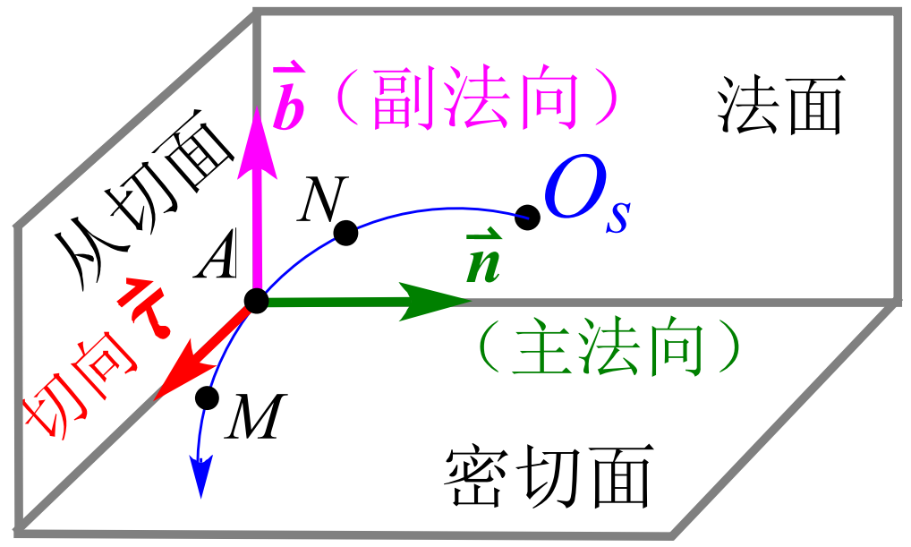
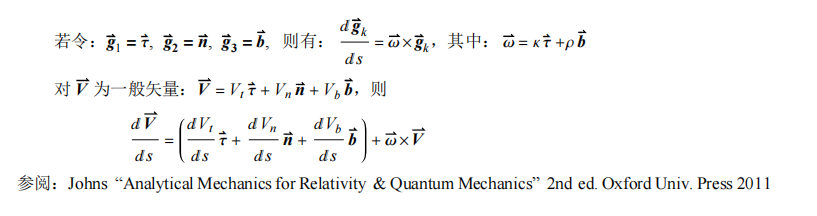

# 曲线坐标系运动学

完全就是大一力学和高数的复习, 正好可以作为新力学的引入. 本文探索如何从传统的 Newton 力学进入新的力学体系.

## 广义坐标的存在

Descartes 坐标与广义坐标存在 **独立连续可微的单值映射**：
$$ 
\boldsymbol{q}=\boldsymbol{f}\left( \boldsymbol{x} \right).
$$

广义坐标的独立要求 Jacobi 行列式不等于 0:

$$
J=\frac{\partial \left( q_1,q_2,q_3 \right)}{\partial \left( x_1,x_2,x_3 \right)}=\left| \begin{matrix}
	\partial _{x_1}q_1&		\partial _{x_2}q_1&		\partial _{x_3}q_1\\
	\partial _{x_1}q_2&		\partial _{x_2}q_2&		\partial _{x_3}q_2\\
	\partial _{x_1}q_3&		\partial _{x_2}q_3&		\partial _{x_3}q_3\\
\end{matrix} \right|\ne 0.
$$

## Lame 系数与广义坐标单位基矢量 $\hat{\boldsymbol{q}_i}$

以下采取 Einstein 求和约定, 我们希望 (至少我希望) 将 $\mathrm{d}\boldsymbol{r}$ 写成如下形式[^1]:

$$
\mathrm{d}\boldsymbol{r}=h_i\mathrm{d}q_i\hat{\boldsymbol{q}_i}.
$$

其中 $h_i$ 是 Lame 系数, 关于其的很多超级棒的性质我本人参考的是[这篇文章](https://zhuanlan.zhihu.com/p/155620740?utm_medium=social&utm_psn=1814787282529546240&utm_source=wechat_session), 这是一个非常符合人类直觉的刻画微分几何的系数. 把上面这个形式和 Descartes 坐标系下的微元表达式比较:

$$
\mathrm{d}\boldsymbol{r}=h_i\mathrm{d}q_i\hat{\boldsymbol{q}_i}=x_i\hat{\boldsymbol{x}_i}
$$

或者写成分量式

$$
\frac{\partial \boldsymbol{r}}{\partial q_i}\mathrm{d}q_i=h_i\mathrm{d}q_i\hat{\boldsymbol{q}_i}.
$$

更近一步地

$$
\frac{\partial x_1}{\partial q_i}\hat{\boldsymbol{x}}_1+\frac{\partial x_2}{\partial q_i}\hat{\boldsymbol{x}}_2+\frac{\partial x_3}{\partial q_i}\hat{\boldsymbol{x}}_3=h_i\hat{\boldsymbol{q}_i}.
$$

两边取模长就得到了对应 Lame 系数的表达式:

$$
h_i=\sqrt{\left( \frac{\partial x_1}{\partial q_i} \right) ^2+\left( \frac{\partial x_2}{\partial q_i} \right) ^2+\left( \frac{\partial x_3}{\partial q_i} \right) ^2}.
$$

带回去得到单位基矢量:

$$
\hat{\boldsymbol{q}}_i=\frac{\frac{\partial x_1}{\partial q_i}\hat{\boldsymbol{x}}_1+\frac{\partial x_2}{\partial q_i}\hat{\boldsymbol{x}}_2+\frac{\partial x_3}{\partial q_i}\hat{\boldsymbol{x}}_3}{h_i}=\frac{\frac{\partial x_1}{\partial q_i}\hat{\boldsymbol{x}}_1+\frac{\partial x_2}{\partial q_i}\hat{\boldsymbol{x}}_2+\frac{\partial x_3}{\partial q_i}\hat{\boldsymbol{x}}_3}{\sqrt{\left( \frac{\partial x_1}{\partial q_i} \right) ^2+\left( \frac{\partial x_2}{\partial q_i} \right) ^2+\left( \frac{\partial x_3}{\partial q_i} \right) ^2}}.
$$

## 从 Decartes 坐标系到曲线坐标系的**度规**

**度规**（metric matrix）的意思, 用按我理解的最通俗的语言来讲, 就是在两个坐标系之间换算长度的矩阵, 毕竟英文 metric 的含义大家都明白, 翻译成中文"度规"这个比较生疏的词汇难免让人感到害怕, 或许是中国物理学家比较爱装b, 才翻译得这么高雅.

此处通过介绍 Decartes 坐标系 (初中就学过的, 大家最熟悉也是最符合人类直觉) 到一般曲线坐标系来引出度规的概念.

$$
\begin{align*}
\mathrm{d}\boldsymbol{r}\cdot \mathrm{d}\boldsymbol{r}&=\left( h_i\mathrm{d}q_i\hat{q}_i \right) \cdot \left( h_j\mathrm{d}q_j\hat{q}_j \right) 
\\\\
&=\left( h_i\hat{q}_i \right) \cdot \left( h_j\hat{q}_j \right) \mathrm{d}q_i\mathrm{d}q_j
\\\\
&=\left( \frac{\partial x_k}{\partial q_i}\hat{x}_p \right) \cdot \left( \frac{\partial x_l}{\partial q_j}\hat{x}_q \right) \mathrm{d}q_i\mathrm{d}q_j
\\\\
&=\frac{\partial x_k}{\partial q_i}\frac{\partial x_k}{\partial q_j}\mathrm{d}q_i\mathrm{d}q_j\qquad \left( \hat{x}_k\cdot \hat{x}_l\ne 0, \mathrm{only}\, \mathrm{if}\,\, k=l \right) 
\\\\
:&=g_{ij}\mathrm{d}q_i\mathrm{d}q_j.
\end{align*}
$$

度规的定义, 就是 $\boldsymbol{G}=(g_{ij})$, 更具体地

$$
g_{ij}=\frac{\partial x_k}{\partial q_i}\frac{\partial x_k}{\partial q_j}=\frac{\partial x_1}{\partial q_i}\frac{\partial x_1}{\partial q_j}+\frac{\partial x_2}{\partial q_i}\frac{\partial x_2}{\partial q_j}+\frac{\partial x_3}{\partial q_i}\frac{\partial x_3}{\partial q_j}.
$$

特别地, 如果曲线坐标系是正交的, 那么

$$
\hat{q}_i\cdot \hat{q}_j=0.\qquad \mathrm{for}\ i\ne j
$$

度规张量 $\boldsymbol{G}$ 就被对角化了.

## 非广义的速度与加速度

非广义的意思是, 速度的量纲仍然是 $\mathrm{m}/\mathrm{s}$, 加速度的量纲仍然是 $\mathrm{m}/\mathrm{s}^2$, 方向是沿着单位向量的. 广义速度则是指在位形空间中 (坐标用广义坐标) 质点位置对应的点的速度, 加速度同理定义.

根据速度的定义:

$$
\frac{\mathrm{d}\boldsymbol{r}}{\mathrm{d}t}=\frac{\mathrm{d}\boldsymbol{r}}{\mathrm{d}q_{\alpha}}\frac{\mathrm{d}q_{\alpha}}{\mathrm{d}t}=h_{\alpha}\hat{q}_{\alpha}\dot{q}_{\alpha}.
$$

简直是易如反掌啊易如反掌, 再定义个非广义速度

$$
v_{\alpha}=h_{\alpha}\dot{q}_{\alpha}.
$$

恰好等于 Lame 系数乘上位形速度, 泰国丸美, 又一次体现了 Lame 系数关联位形空间与物理空间的性质. 但是加速度的推导似乎不那么优雅了, 此处注意到 Lame 系数和单位矢量都是时间的函数, 求导要展开三项, 更糟糕的是 Lame 系数恶心的表达式让人完全没有算下去的欲望, 林志方老师为我们提供了一个妙手:

> 引理 (**点点消[^2]**):
> $$\frac{\partial \boldsymbol{r}}{\partial q_{\alpha}}=\frac{\partial \dot{\boldsymbol{r}}}{\partial \dot{q}_{\alpha}}.$$

**证:**
$$
\frac{\partial \dot{\boldsymbol{r}}}{\partial \dot{q}_{\alpha}}=\frac{\partial}{\partial \dot{q}_{\alpha}}\left( h_{\beta}\dot{q}_{\beta}\hat{q}_{\beta} \right) =h_{\beta}\hat{q}_{\beta}\frac{\partial \dot{q}_{\beta}}{\partial \dot{q}_{\alpha}}=\delta _{\alpha \beta}h_{\beta}\hat{q}_{\beta}=h_{\alpha}\hat{q}_{\alpha}=\frac{\partial \boldsymbol{r}}{\partial q_{\alpha}}.
$$

这里, 运用了一个事实, **Lame 系数和单位矢量与位形速度无关, 只与位形有关**.

> 引理 (**对广义坐标的偏导数和对时间的全导数对易**):
> $$\frac{\mathrm{d}}{\mathrm{d}t}\frac{\partial\boldsymbol{r}}{\partial \alpha}=\frac{\partial}{\partial \alpha}\frac{\mathrm{d}\boldsymbol{r}}{\mathrm{d}t}.$$

**证:**
$$
\begin{align*}
\frac{\mathrm{d}}{\mathrm{d}t}\frac{\partial \boldsymbol{r}}{\partial q_{\alpha}}&=\sum_{\beta =1}^3{\frac{\partial}{\partial q_{\beta}}\frac{\partial \boldsymbol{r}}{\partial q_{\alpha}}\frac{\mathrm{d}q_{\beta}}{\mathrm{d}t}}
\\
&=\sum_{\beta =1}^3{\frac{\partial}{\partial q_{\alpha}}\frac{\partial \boldsymbol{r}}{\partial q_{\beta}}\frac{\mathrm{d}q_{\beta}}{\mathrm{d}t}}
\\
&=\frac{\partial}{\partial q_{\alpha}}\sum_{\beta =1}^3{\left( \frac{\partial \boldsymbol{r}}{\partial q_{\beta}}\frac{\mathrm{d}q_{\beta}}{\mathrm{d}t} \right)}
\\
&=\frac{\partial}{\partial q_{\alpha}}\frac{\mathrm{d}\boldsymbol{r}}{\mathrm{d}q_{\beta}}
\end{align*}
$$

从下面开始就开始求加速度了. 记加速度的表达式是

$$
\boldsymbol{a}=h_{\alpha}a_{\alpha}\hat{q}_{\alpha}.
$$

于是

$$
\begin{align*}
a_{\beta}=\hat{q}_{\beta}\cdot \boldsymbol{a}&=\hat{q}_{\beta}\cdot \frac{\mathrm{d}\boldsymbol{v}}{\mathrm{d}t}=\frac{1}{h_{\beta}}\frac{\partial \boldsymbol{r}}{\partial q_{\beta}}\cdot \frac{\mathrm{d}\boldsymbol{v}}{\mathrm{d}t}=\frac{1}{h_{\beta}}\left[ \frac{\mathrm{d}}{\mathrm{d}t}\left( \boldsymbol{v}\cdot \frac{\partial \boldsymbol{r}}{\partial q_{\beta}} \right) -\boldsymbol{v}\cdot \frac{\mathrm{d}}{\mathrm{d}t}\frac{\partial \boldsymbol{r}}{\partial q_{\beta}} \right] 
\\
&=\frac{1}{h_{\beta}}\left[ \frac{\mathrm{d}}{\mathrm{d}t}\left( \boldsymbol{v}\cdot \frac{\partial \boldsymbol{v}}{\partial \dot{q}_{\beta}} \right) -\boldsymbol{v}\cdot \frac{\mathrm{d}}{\mathrm{d}t}\frac{\partial \boldsymbol{v}}{\partial \dot{q}_{\beta}} \right] =\frac{1}{h_{\beta}}\left[ \frac{\mathrm{d}}{\mathrm{d}t}\frac{\partial}{\partial \dot{q}_{\beta}}\left( \frac{v^2}{2} \right) -\boldsymbol{v}\cdot \frac{\partial \boldsymbol{v}}{\partial q_{\beta}} \right] 
\\
&=\frac{1}{h_{\beta}}\left[ \frac{\mathrm{d}}{\mathrm{d}t}\frac{\partial}{\partial \dot{q}_{\beta}}\left( \frac{v^2}{2} \right) -\frac{\partial}{\partial q_{\beta}}\left( \frac{v^2}{2} \right) \right] =\frac{1}{h_{\beta}}\left[ \frac{\mathrm{d}}{\mathrm{d}t}\frac{\partial}{\partial \dot{q}_{\beta}}-\frac{\partial}{\partial q_{\beta}} \right] \left( \frac{v^2}{2} \right) 
\end{align*}
$$

这个表达式简直和 Euler-Lagrange 表达式不要太像 (推导看[这里](https://mp.weixin.qq.com/s/CCxk1K8-QJkGbo3MSOnXOA)), 这又是物理学和数学的巧合吗? 亦或者有什么奇妙的联系!?

## Lagrange 量
直到这里, 我们都是纯粹地使用 Newton 力学和一丢丢高等数学, 就可以得出 Lagrange 量! 下面看我操作:

$$
F_{\alpha}=ma_{\alpha}=\frac{1}{h_{\alpha}}\left[ \frac{\mathrm{d}}{\mathrm{d}t}\frac{\partial}{\partial \dot{q}_{\alpha}}-\frac{\partial}{\partial q_{\alpha}} \right] \left( \frac{mv^2}{2} \right) =\frac{1}{h_{\alpha}}\left[ \frac{\mathrm{d}}{\mathrm{d}t}\frac{\partial}{\partial \dot{q}_{\alpha}}-\frac{\partial}{\partial q_{\alpha}} \right] T.
$$

其中 $T\coloneqq \frac{mv^2}{2}$ 被定义为动能. 如果力可以写作场的形式, 则

$$
F_{\alpha}=-\left( \nabla U \right) _{\alpha}+\left( \nabla \times A \right) _{\alpha}.
$$

这里运用了 Helmholtz 定理, 推导看[这里](https://mp.weixin.qq.com/s/kYMtFX1pHfI-f0owgrRj1Q), 当然这里力仅仅可写成场是不足够的, 还需要保守, 也就是场的有旋部分为 0:

$$
\nabla \times A=0.
$$

则

$$
-\left( \nabla U \right) _{\alpha}=\frac{1}{h_{\alpha}}\left[ \frac{\mathrm{d}}{\mathrm{d}t}\frac{\partial}{\partial \dot{q}_{\alpha}}-\frac{\partial}{\partial q_{\alpha}} \right] T.
$$

于是

$$
-\frac{1}{h_{\alpha}}\frac{\partial U}{\partial q_{\alpha}}=\frac{1}{h_{\alpha}}\left[ \frac{\mathrm{d}}{\mathrm{d}t}\frac{\partial}{\partial \dot{q}_{\alpha}}-\frac{\partial}{\partial q_{\alpha}} \right] T.
$$

而势能与位形速度无关, 所以

$$
\frac{1}{h_{\alpha}}\left[ \frac{\mathrm{d}}{\mathrm{d}t}\frac{\partial}{\partial \dot{q}_{\alpha}}-\frac{\partial}{\partial q_{\alpha}} \right] \left( T-U \right) =0.
$$

$L\coloneqq T-U$ 被称作 Lagrange 量. OH-MY-GOD!

## 自然坐标系与 Seret-Frenet 架构
其实这部分是高数课上的内容, 但当时老师觉得这部分过于繁琐与无聊所以就没讲 (他可能觉得 Fourier 分析与微分方程更重要, 毕竟这部分期末考试被系里面重点要求), 到了经典力学又要捡回来再学一遍, 不过无所谓因为我会出手.

此图镇场, 学会此图便学会了自然坐标系. 首先我们知道, 当微变时, 弧长约等于弦长:

$$
\left| \mathrm{d}s \right|=\left| \mathrm{d}\boldsymbol{r} \right|+o\left( \left| \mathrm{d}\boldsymbol{r} \right| \right)  .
$$

于是给出了第一个单位矢量:

$$
\hat{\tau}=\frac{\mathrm{d}\boldsymbol{r}}{\mathrm{d}s}.
$$

这样定义是因为恰好

$$
\left| \hat{\tau} \right|=\left| \frac{\mathrm{d}\boldsymbol{r}}{\mathrm{d}s} \right|=1,
$$

且方向延切线. 得到了延切线的单位矢量, 自然可以定义速度:

$$
\boldsymbol{v}=\frac{\mathrm{d}\boldsymbol{r}}{\mathrm{d}t}=\frac{\mathrm{d}\boldsymbol{r}}{\mathrm{d}s}\frac{\mathrm{d}s}{\mathrm{d}t}=v\hat{\tau}.
$$

现在似乎无法接着找出单位矢量了, 先导一发先:

$$
\boldsymbol{a}=\frac{\mathrm{d}\boldsymbol{v}}{\mathrm{d}t}=\frac{\mathrm{d}v}{\mathrm{d}t}\hat{\tau}+v\frac{\mathrm{d}\hat{\tau}}{\mathrm{d}t}=\frac{\mathrm{d}v}{\mathrm{d}t}\hat{\tau}+v\frac{\mathrm{d}\hat{\tau}}{\mathrm{d}s}\frac{\mathrm{d}s}{\mathrm{d}t}=\frac{\mathrm{d}v}{\mathrm{d}t}\hat{\tau}+v^2\frac{\mathrm{d}\hat{\tau}}{\mathrm{d}s}.
$$

右侧第二项有点像力学里的向心加速度, 试试看能不能靠上去, 定义

$$
\frac{\mathrm{d}\hat{\tau}}{\mathrm{d}s}={\kappa}\hat{n}.
$$

其中 $\kappa$ 被定义为当地的 (local) 曲率, 此处和林志方老师的讲义略有出入, 我有理由怀疑老师的讲义存在错误. 如此定义的话, 天然地有

$$
\left| \hat{n} \right|=1.
$$

下面说明 $\hat{n}\bot\hat{\tau}$:

$$
0=\frac{\mathrm{d}1}{\mathrm{d}s}=\frac{\mathrm{d}\left( \hat{\tau}\cdot \hat{\tau} \right)}{\mathrm{d}s}=2\hat{\tau}\cdot \frac{\mathrm{d}\hat{\tau}}{\mathrm{d}s}=2\hat{\tau}\cdot  {\kappa}\hat{n}.
$$

WOW! 现在我们有两个单位矢量了, 按照右手系的惯例, 直接叉乘定义第三个单位矢量:

$$
\hat{b}=\hat{\tau}\times \hat{n}.
$$

$\rho$ 在此处应当是**扭率 (torsion)** 的意思:

$$
\rho =-\hat{n}\cdot \frac{\mathrm{d}\hat{b}}{\mathrm{d}s}.
$$

这个概念描述的是曲线扭出密切面的"程度", 和曲率是两个独立描述空间曲线弯曲程度的量, 很抽象就对了.

> 公式:
> $$\frac{\mathrm{d}\hat{n}}{\mathrm{d}s}=-\kappa \hat{\tau}+\rho \hat{b}.$$

**证:**
此处手法需要一点点手法, 根据正交性:

$$
\hat{\tau}\cdot \hat{n}=0.
$$

两边导一导:

$$
\frac{\mathrm{d}\hat{\tau}}{\mathrm{d}s}\cdot \hat{n}+\hat{\tau}\cdot \frac{\mathrm{d}\hat{n}}{\mathrm{d}s}=0.
$$

带入定义:

$$
\kappa \hat{n}\cdot \hat{n}+\hat{\tau}\cdot \frac{\mathrm{d}\hat{n}}{\mathrm{d}s}=0.
$$

即

$$
\hat{\tau}\cdot \frac{\mathrm{d}\hat{n}}{\mathrm{d}s}=-\kappa .
$$

同理:

$$
\hat{n}\cdot \hat{b}=0
$$

$$
\frac{\mathrm{d}\hat{n}}{\mathrm{d}s}\cdot \hat{b}+\hat{n}\cdot \frac{\mathrm{d}\hat{b}}{\mathrm{d}s}=0
$$

$$
\frac{\mathrm{d}\hat{n}}{\mathrm{d}s}\cdot \hat{b}-\rho =0
$$

$$
\frac{\mathrm{d}\hat{n}}{\mathrm{d}s}\cdot \hat{b}=\rho 
$$

不妨设

$$
\frac{\mathrm{d}\hat{n}}{\mathrm{d}s}=\lambda _1\hat{\tau}+\lambda _2\hat{b}.
$$

那么

$$
\lambda _1=\frac{\mathrm{d}\hat{n}}{\mathrm{d}s}\cdot \hat{\tau}=-\kappa ,
$$

$$
\lambda _2=\frac{\mathrm{d}\hat{n}}{\mathrm{d}s}\cdot \hat{b}=\rho .
$$

> 公式:
> $$\frac{\mathrm{d}\hat{b}}{\mathrm{d}s}=-\rho \hat{n}.$$

**证:** 

$$
\begin{align*}
\frac{\mathrm{d}\hat{b}}{\mathrm{d}s}&=\frac{\mathrm{d}\hat{\tau}}{\mathrm{d}s}\times \hat{n}+\hat{\tau}\times \frac{\mathrm{d}\hat{n}}{\mathrm{d}s}
\\
&=\kappa \hat{n}\times \hat{n}+\hat{\tau}\times \left( -\kappa \hat{\tau}+\rho \hat{b} \right) 
\\
&=\rho \hat{\tau}\times \hat{b}=-\rho \hat{n}.
\end{align*}
$$

综合以上, 得到了 Seret-Frenet 架构的数学表达式:

> $$
> \frac{\mathrm{d}}{\mathrm{d}s}\left( \begin{array}{c}
>	\hat{\tau}\\
>	\hat{n}\\
>	\hat{b}\\
> \end{array} \right) =\left( \begin{matrix}
>	\,\,&		\kappa&		\,\,\\
>	-\kappa&		\,\,&		\rho\\
>	\,\,&		-\rho&		\,\,\\
> \end{matrix} \right) \left( \begin{array}{c}
>	\hat{\tau}\\
>	\hat{n}\\
>	\hat{b}\\
> \end{array} \right) ,\qquad \begin{cases}
>	\kappa =\hat{n}\cdot \frac{\mathrm{d}\hat{\tau}}{\mathrm{d}s},\quad \mathrm{curvature}\\
>	\rho =-\hat{n}\cdot \frac{\mathrm{d}\hat{b}}{\mathrm{d}s},\quad \mathrm{torsion}\\
>\end{cases}
> $$

留一道讲义上的思考题：

[^1]: 注意 $\boldsymbol{r}=\boldsymbol{x}_i\hat{x}_i\ne h_i\boldsymbol{q}_i\boldsymbol{\hat{q}}_i$.
[^2]: 著雨胭脂点点消，半开时节最妖娆
