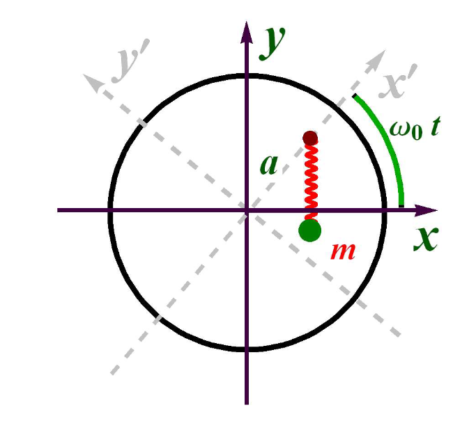
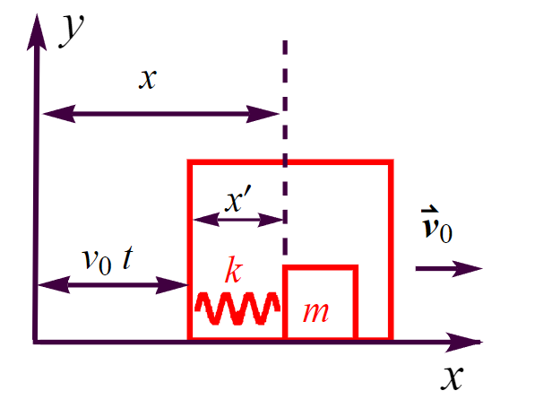

@import "../style.less"

# 经典力学第三次作业

姓名: 林海轩 &nbsp; 学号: 23307110267 &nbsp; 院系: 物理学系 &nbsp; 专业: 物理学

## J02.05
> Suppose that two masses have a motion defined by a Lagrangian function $$L= \dfrac{1}{2}m_1{\vec{\boldsymbol{v}}_1}^2+ \dfrac{1}{2}m_2{\vec{\boldsymbol{v}}_2}^2-U\left( \left| \vec{\boldsymbol{r}}_1-\vec{\boldsymbol{r}}_2 \right| \right) $$ where $\vec{\boldsymbol{r}}_1$ and $\vec{\boldsymbol{r}}_1$ denote the position vectors of masses 1 and 2, respectivley, $$\vec{\boldsymbol{v}}_1= \dfrac{\mathrm{d}\vec{\boldsymbol{r}}_1}{\mathrm{d}t},\qquad \vec{\boldsymbol{v}}_2= \dfrac{\mathrm{d}\vec{\boldsymbol{r}}_2}{\mathrm{d}t},\qquad \vec{\boldsymbol{v}}_{1}^{2}=\vec{\boldsymbol{v}}_1\cdot \vec{\boldsymbol{v}}_1,\qquad \vec{\boldsymbol{v}}_{2}^{2}=\vec{\boldsymbol{v}}_2\cdot \vec{\boldsymbol{v}}_2.$$ Let $\vec{\boldsymbol{r}}=\vec{\boldsymbol{r}}_2-\vec{\boldsymbol{r}}_1,\quad \vec{\boldsymbol{R}}=\dfrac{m_2\vec{\boldsymbol{r}}_2-m_1\vec{\boldsymbol{r}}_1}{m_1+m_2}$
> 
> (a) Rewrite the Lagrangian in terms of the variables  $ \vec{r}  $ and  $ \vec{R}  $ and their time derivatives. Show the Lagrangian can be written as two terms, one of which depends only on  $ \vec{R}  $ and its time derivative and the other only on  $ \vec{r}  $ and its time derivative. Such Lagrangian systems are called separable.
> (b) Show that three components of  $ \vec{R}  $ are ignorable coordinates and that the total momentum of the system is conserved.

### (a) 
We can express $\vec{\boldsymbol{r}}_1$ and $\vec{\boldsymbol{r}}_2$ with $\vec{\boldsymbol{r}}$ and $\vec{\boldsymbol{R}}$ by linear equations group.

$$
\left\{ \begin{array}{c}
	-\vec{\boldsymbol{r}}_1+\vec{\boldsymbol{r}}_2=\vec{\boldsymbol{r}},\\
	-m_1\vec{\boldsymbol{r}}_1+m_2\vec{\boldsymbol{r}}_2=\vec{\boldsymbol{R}}.\\
\end{array} \right. 
$$

so

$$
\left\{ \begin{array}{c}
	\vec{\boldsymbol{r}}_1=\vec{\boldsymbol{R}}-\dfrac{m_2}{m_1+m_2}\vec{\boldsymbol{r}}\\\\
	\vec{\boldsymbol{r}}_2=\vec{\boldsymbol{R}}+\dfrac{m_1}{m_1+m_2}\vec{\boldsymbol{r}}\\
\end{array} \right. 
$$

Subtitude the expressions above into ***Lagrangian***.

$$
\begin{align*}
L&= \dfrac{1}{2}m_1\left( \dot{\vec{\boldsymbol{R}}}- \dfrac{m_2}{m_1+m_2}\dot{\vec{\boldsymbol{r}}} \right) ^2+ \dfrac{1}{2}m_2\left( \dot{\vec{\boldsymbol{R}}}+ \dfrac{m_1}{m_1+m_2}\dot{\vec{\boldsymbol{r}}} \right) ^2-U\left( \left| \vec{\boldsymbol{r}} \right| \right)
\\\\
&= \dfrac{1}{2}\left( m_1+m_2 \right) \dot{\vec{\boldsymbol{R}}}^2+ \dfrac{1}{2} \dfrac{m_1m_2}{m_1+m_2}\dot{\vec{\boldsymbol{r}}}^2-U\left( \left| \vec{\boldsymbol{r}} \right| \right) .
\end{align*}
$$

### (b)
Note that

$$
 \dfrac{\partial L}{\partial \vec{\boldsymbol{R}}}=0,
$$

and there is no $\vec{\boldsymbol{Q}}^{\mathrm{curl}}$ in the system,

$$
\vec{\boldsymbol{Q}}^{\mathrm{curl}}=0,
$$

according to the defination of ***ignorable coordinates***, we can conclude that $\vec{\boldsymbol{R}}$ is definitely a ignorable vector and the three components of it are all ignorable coordinates. Subsitude it into ***Lagrange's equation***,

$$
0=\vec{\boldsymbol{Q}}^{\mathrm{curl}}= \dfrac{\mathrm{d}}{\mathrm{d}t} \dfrac{\partial L}{\partial \dot{\vec{\boldsymbol{R}}}}- \dfrac{\partial L}{\partial \vec{\boldsymbol{R}}}= \dfrac{\mathrm{d}}{\mathrm{d}t} \dfrac{\partial L}{\partial \dot{\vec{\boldsymbol{R}}}}= \dfrac{\mathrm{d}}{\mathrm{d}t}\left( m_1+m_2 \right) \dot{\vec{\boldsymbol{R}}}.
$$

And we write down the total momentum of the whole system,

$$
\vec{\boldsymbol{P}}= \dfrac{\partial L}{\partial \vec{\boldsymbol{v}}_1}+ \dfrac{\partial L}{\partial \vec{\boldsymbol{v}}_2}=\left( m_1+m_2 \right) \dot{\vec{\boldsymbol{R}}}
$$

So

$$
 \dfrac{\mathrm{d}}{\mathrm{d}t}\vec{\boldsymbol{P}}= \dfrac{\partial L}{\partial \vec{\boldsymbol{v}}_1}+ \dfrac{\partial L}{\partial \vec{\boldsymbol{v}}_2}= \dfrac{\mathrm{d}}{\mathrm{d}t}\left( m_1+m_2 \right) \dot{\vec{\boldsymbol{R}}}=0.
$$

We can definitely assert that the total momentum of the system is conserved.

## J02.06
> A mass $m$ is acted on by a force derived from the generalized potential
> $$U^{(\mathrm{vel)}}(\vec{\boldsymbol{r}},\vec{\boldsymbol{v}},t)=V(r)+\vec{\boldsymbol{\sigma}}\cdot \vec{\boldsymbol{L}}$$ with the superscript "(vel)" denoting velocity dependent potential where $r = \sqrt{x^2 + y^2 + z^2}$, $\vec{\boldsymbol{\sigma}}=\sigma \vec{\boldsymbol{e}}_z$, $\vec{\boldsymbol{L}}=\vec{\boldsymbol{r}}\times m\vec{\boldsymbol{v}}$ and $\vec{\boldsymbol{r}}$ and $\vec{\boldsymbol{v}}$ are the position and velocity of the mass relative to some inertial coordinate system.
> 
> (a) Express $U^{(\text{vel})}$ in Cartesian coordinates (the $s$ system) $x, y, z, \dot{x}, \dot{y}, \dot{z}$ and find the force $\vec{\boldsymbol{F}}$ and its three Cartesian components $F_x, F_y, F_z$.
> (b) Express $ U^{(\text{vel})}$ in spherical polar coordinates (that can be called the $q$ system) $r, \theta, \phi, \dot{r}, \dot{\theta}, \dot{\phi}$ and find the generalized force $Q_k$, $k = 1, 2, 3$.
> (c) The force vector found in (a) can be rewritten in terms of spherical polar unit vectors as $$\vec{\boldsymbol{F}}=F_r\vec{\boldsymbol{e}}_r+F_{\theta}\vec{\boldsymbol{e}}_{\theta}+F_{\phi}\vec{\boldsymbol{e}}_{\phi}$$ with $F_r=\vec{\boldsymbol{e}}_r\cdot \vec{\boldsymbol{F}}$, $F_{\theta}=\vec{\boldsymbol{e}}_{\theta}\cdot \vec{\boldsymbol{F}}$, $F_{\phi}=\vec{\boldsymbol{e}}_{\phi}\cdot \vec{\boldsymbol{F}}$. Show $Q_r = F_r$.
> (d) However $Q_\phi \neq F_\phi$, what does $Q_\phi$ correspond to in Newton Mechanics? What is the dimensionality of $Q_\phi \delta\phi$?
> (e) Based on this example, what do you learn about the difference between the orthogonal curvilinear coordinate system and the generalized coordinates?

### (a)
Note that $V(r)$ has spherical symmetry, as a result when we tend to express $U^{\text{(vel)}}$ we only need to consider $\vec{\boldsymbol{\sigma}}\cdot \vec{\boldsymbol{L}}$,

$$
\vec{\boldsymbol{\sigma}}\cdot \vec{\boldsymbol{L}}=\sigma \vec{\boldsymbol{e}}_z\cdot m\left[ \left( y\dot{z}-\dot{y}z \right) \vec{\boldsymbol{e}}_x+\left( z\dot{x}-\dot{z}x \right) \vec{\boldsymbol{e}}_y+\left( x\dot{y}-\dot{x}y \right) \vec{\boldsymbol{e}}_z \right] =\sigma m\left( x\dot{y}-\dot{x}y \right) .
$$

The spherical symmetry is reflected in

$$
 \dfrac{\partial V\left( r \right)}{\partial x}=- \dfrac{x}{r} \dfrac{\mathrm{d}V\left( r \right)}{\mathrm{d}r},\quad  \dfrac{\partial V\left( r \right)}{\partial y}=- \dfrac{y}{r} \dfrac{\mathrm{d}V\left( r \right)}{\mathrm{d}r},\quad  \dfrac{\partial V\left( r \right)}{\partial z}=- \dfrac{z}{r} \dfrac{\mathrm{d}V\left( r \right)}{\mathrm{d}r}.
$$

and in $\vec{\boldsymbol{\sigma}}\cdot \vec{\boldsymbol{L}}$ the $x$ and $-y$ play the totally same role, as a result, if I write $F_x$,

$$
F_x= \dfrac{\mathrm{d}}{\mathrm{d}t} \dfrac{\partial U^{\left( \mathrm{vel} \right)}}{\partial \dot{x}}- \dfrac{\partial U^{\left( \mathrm{vel} \right)}}{\partial x}=- \dfrac{x}{r} \dfrac{\mathrm{d}V\left( r \right)}{\mathrm{d}r}-2\sigma m\dot{y},
$$

I can immediately write $F_y$ with $x$ be subsitituted by $-y$,

$$
F_y=- \dfrac{y}{r} \dfrac{\mathrm{d}V\left( r \right)}{\mathrm{d}r}+2\sigma m\dot{x}.
$$

And 

$$
F_z= \dfrac{\mathrm{d}}{\mathrm{d}t} \dfrac{\partial U^{\left( \mathrm{vel} \right)}}{\partial \dot{z}}- \dfrac{\partial U^{\left( \mathrm{vel} \right)}}{\partial z}=- \dfrac{z}{r} \dfrac{\mathrm{d}V\left( r \right)}{\mathrm{d}r}.
$$

### (b)
Here is a trick in mathetatics when simplify $x\dot{y}-\dot{x}y$ in spherical polar coordinates,

$$
x\dot{y}-\dot{x}y=x^2 \dfrac{\mathrm{d}}{\mathrm{d}t} \dfrac{y}{x}=r^2\sin ^2\theta \cos ^2\phi  \dfrac{\mathrm{d}}{\mathrm{d}t}\tan \phi =r^2\sin ^2\theta \dot{\phi}.
$$

So it is very tidy and we can write down the expression of $U^{\left( \mathrm{vel} \right)}$ in spherical polar coordinate smoothly,

$$
U^{\left( \mathrm{vel} \right)}=V\left( r \right) +m\sigma r^2\sin ^2\theta \dot{\phi}.
$$

As a result,

$$
\begin{align*}
Q_r&= \dfrac{\mathrm{d}}{\mathrm{d}t} \dfrac{\partial U^{\left( \mathrm{vel} \right)}}{\partial \dot{r}}- \dfrac{\partial U^{\left( \mathrm{vel} \right)}}{\partial r}=- \dfrac{\mathrm{d}V\left( r \right)}{\mathrm{d}r}-2m\sigma r\sin ^2\theta \dot{\phi},
\\
Q_{\theta}&= \dfrac{\mathrm{d}}{\mathrm{d}t} \dfrac{\partial U^{\left( \mathrm{vel} \right)}}{\partial \dot{\theta}}- \dfrac{\partial U^{\left( \mathrm{vel} \right)}}{\partial \theta}=-m\sigma r^2\sin 2\theta \dot{\phi},
\\
Q_{\phi}&= \dfrac{\mathrm{d}}{\mathrm{d}t} \dfrac{\partial U^{\left( \mathrm{vel} \right)}}{\partial \dot{\phi}}- \dfrac{\partial U^{\left( \mathrm{vel} \right)}}{\partial \phi}=2m\sigma r\sin \theta \left( \dot{r}\sin \theta +r\cos \theta \dot{\theta} \right) .
\end{align*}
$$

### (c)
We konw that in *Cartesion coordinates* we have

$$
\vec{\boldsymbol{F}}=\left( - \dfrac{x}{r} \dfrac{\mathrm{d}V\left( r \right)}{\mathrm{d}r}-2\sigma m\dot{y} \right) \vec{\boldsymbol{e}}_x+\left( - \dfrac{y}{r} \dfrac{\mathrm{d}V\left( r \right)}{\mathrm{d}r}+2\sigma m\dot{x} \right) \vec{\boldsymbol{e}}_y+\left( - \dfrac{z}{r} \dfrac{\mathrm{d}V\left( r \right)}{\mathrm{d}r} \right) \vec{\boldsymbol{e}}_z.
$$

And we know some relationship between $\vec{\boldsymbol{e}}_r$ and $x, y, z$,

$$
\vec{\boldsymbol{e}}_r= \dfrac{x\vec{\boldsymbol{e}}_x+y\vec{\boldsymbol{e}}_y+z\vec{\boldsymbol{e}}_z}{r}.
$$

Some we combine the two expressions and have

$$
\begin{align*}
F_r&=\vec{\boldsymbol{e}}_r\cdot \vec{\boldsymbol{F}}= \dfrac{x}{r}\left( - \dfrac{x}{r} \dfrac{\mathrm{d}V\left( r \right)}{\mathrm{d}r}-2\sigma m\dot{y} \right) + \dfrac{y}{r}\left( - \dfrac{y}{r} \dfrac{\mathrm{d}V\left( r \right)}{\mathrm{d}r}+2\sigma m\dot{x} \right) + \dfrac{z}{r}\left( - \dfrac{z}{r} \dfrac{\mathrm{d}V\left( r \right)}{\mathrm{d}r} \right) 
\\
&=- \dfrac{\mathrm{d}V\left( r \right)}{\mathrm{d}t}-2m\sigma  \dfrac{x\dot{y}-\dot{x}y}{r}.
\end{align*}
$$

Remenber we have prove $x\dot{y}-\dot{x}y=r^2\sin ^2\theta \dot{\phi}$, take it into above expression,

$$
F_r=- \dfrac{\mathrm{d}V\left( r \right)}{\mathrm{d}t}-2m\sigma r\sin ^2\theta \dot{\phi}=Q_r.
$$

### (d)
We need to perform an identity transformation on the expression of $Q_\phi$, so as to figure out what is the corresponding function of it in Cartesion coordinate.

$$
\begin{align*}
Q_{\phi}&=2m\sigma r\sin \theta \left( \dot{r}\sin \theta +r\cos \theta \dot{\theta} \right) =m\sigma  \dfrac{\mathrm{d}}{\mathrm{d}t}\left( r\sin \theta \right) ^2=m\sigma  \dfrac{\mathrm{d}}{\mathrm{d}t}\left( x^2+y^2 \right) =m\sigma \left( 2x\dot{x}+2y\dot{y} \right) 
\\
&=xF_y-yF_x.
\end{align*}
$$

And note that

$$
xF_y-yF_x=\vec{\boldsymbol{e}}_z\cdot \left( \vec{\boldsymbol{r}}\times \vec{\boldsymbol{F}} \right) .
$$

As a result, $Q_\phi$ is the torque in direction of $z$ in Newtom Mechanics. So $Q_\phi\delta\phi$ means the work made by torque in $z$ direction.

$$
\mathrm{dim}Q_{\phi}=\left[ \mathrm{M} \right] \left[ \mathrm{L} \right] ^2\left[ T \right] ^{-2}.
$$

### (e)
We has testify the conclusion which we have learned in class:
+ In $s$-system, the force is just like what we are used to, it is consistent with the conception Newton gived.
+ In $q$-system, the force is so-called generalized force and may not be consistent with the conception in Newton mechanics, but if we mutiply generalized force and its conjugate generalize coordinate together, the gerneralized work is just work and has the same dimensionality Joule. 

## J02.09
> A horizontal, circular table with a frictionless top surface is constrained to rotate about a vertical line through its center, with constant angular velocity  $\omega_0$. A peg is driven into the table top at a distance  $a$ from the center of the circle. A mass  $m$ slides freely on the top surface of the table, connected to the peg by a massless spring of force constant  $k$ and zero rest length. Take the  $s$ system to be an inertial system of Cartesian coordinates  $x, y$ with the origin at the center of the table top, and the  $q$ system to be rotating Cartesian coordinates  $x', y'$ defined so that  $\vec{e}_{x'}$ defines a line passing through the peg. Ignore the  $z$-coordinate, and treat this problem as one with two degrees of freedom. The transformation between coordinates of the mass in the two systems is $$x = x' \cos \omega_0 t - y' \sin \omega_0 t, \quad y = x' \sin \omega_0 t + y' \cos \omega_0 t$$
>  
> (a) Write  $L(s, \dot{s}, t)$ in the  $s$ system and  $L(q, \dot{q}, t)$ in the  $q$ system.
> (b) Write  $H_s$ in the  $s$ system. Is it equal to  $T + U$? Is it conserved?
> (c) Write  $H_q$ in the  $q$ system. Is it equal to  $T + U$? Is it conserved?
> (d) What do you learn about the conservativeness and generalized energy function?

### (a)
Note that we can use a rotation matrix to describe the transformation between the to system,

$$
\left( \begin{array}{c}
	x^{\prime}\\
	y^{\prime}\\
\end{array} \right) =\left( \begin{matrix}
	\cos \omega _0t&		\sin \omega _0t\\
	-\sin \omega _0t&		\cos \omega _0t\\
\end{matrix} \right) \left( \begin{array}{c}
	x\\
	y\\
\end{array} \right) .
$$

In the $s$-system, it is classic Newtom mechanics inertial Cartesian coordinates and so we can use $L=T-K$ to swiftly wrirte Lagrangian

$$
L\left( s,\dot{s},t \right) = \dfrac{1}{2}m\left( \dot{x}^2+\dot{y}^2 \right) - \dfrac{1}{2}k\left[ \left( x-a\cos \omega _0t \right) ^2+\left( y-a\sin \omega _0t \right) ^2 \right] .
$$

In $q$-system it is easy to write the mechanical potential energy,

$$
U\left( q,t \right) = \dfrac{1}{2}k\left[ \left( x^{\prime}-a \right) ^2+{y^{\prime}}^2 \right] .
$$

Here I perform a mathmatical trick to find kinetic. We can write position vector as

$$
\vec{\boldsymbol{r}}^{\prime}=\mathrm{e}^{\mathrm{i}\omega _0t}\vec{\boldsymbol{r}}.
$$

In this expresion way, we use complex number to replcae matrix to describe rotation, we will see some elegent effects as follow. But in the next equation, we use $\mathbf{R}$ for subsititude for the being time so as to emphasize the properties of matrix,

$$
\begin{align*}
\dot{x}^2+\dot{y}^2&={\dot{\vec{\boldsymbol{r}}}^{\prime}}^{\mathrm{T}}\cdot \dot{\vec{\boldsymbol{r}}}^{\prime}=\left( \dot{\mathbf{R}}\vec{\boldsymbol{r}}^{\prime}+\mathbf{R}\dot{\vec{\boldsymbol{r}}}^{\prime} \right) ^{\mathrm{T}}\cdot \left( \dot{\mathbf{R}}\vec{\boldsymbol{r}}^{\prime}+\mathbf{R}\dot{\vec{\boldsymbol{r}}}^{\prime} \right) 
\\
&=\left( {\vec{\boldsymbol{r}}^{\prime}}^{\mathrm{T}}\dot{\mathbf{R}}^{\mathrm{T}}+{\dot{\vec{\boldsymbol{r}}}^{\prime}}^{\mathrm{T}}\mathbf{R}^{\mathrm{T}} \right) \cdot \left( \dot{\mathbf{R}}\vec{\boldsymbol{r}}^{\prime}+\mathbf{R}\dot{\vec{\boldsymbol{r}}}^{\prime} \right) 
\\
&={\vec{\boldsymbol{r}}^{\prime}}^{\mathrm{T}}\dot{\mathbf{R}}^{\mathrm{T}}\cdot \dot{\mathbf{R}}\vec{\boldsymbol{r}}^{\prime}+{\vec{\boldsymbol{r}}^{\prime}}^{\mathrm{T}}\dot{\mathbf{R}}^{\mathrm{T}}\cdot \mathbf{R}\dot{\vec{\boldsymbol{r}}}^{\prime}+{\dot{\vec{\boldsymbol{r}}}^{\prime}}^{\mathrm{T}}\mathbf{R}^{\mathrm{T}}\cdot \dot{\mathbf{R}}\vec{\boldsymbol{r}}^{\prime}+{\dot{\vec{\boldsymbol{r}}}^{\prime}}^{\mathrm{T}}\mathbf{R}^{\mathrm{T}}\cdot \mathbf{R}\dot{\vec{\boldsymbol{r}}}^{\prime}
\end{align*}
$$

We know that the orthogonal matrix has some beatiful properties, here what we will use immediately:

$$
\begin{align*}
&\mathbf{R}^{\mathrm{T}}=\mathbf{R}^{-1},
\\
&\dot{\mathbf{R}}=\mathrm{i}\omega _0\mathrm{e}^{\mathrm{i}\omega _0t},
\\
&\dot{\mathbf{R}}^{\mathrm{T}}=\left( \mathrm{i}\omega _0\mathrm{e}^{\mathrm{i}\omega _0t} \right) ^{\mathrm{T}}=\left( \mathrm{i}\omega _0 \right) ^{\mathrm{T}}\mathbf{R}^{\mathrm{T}}=-\mathrm{i}\omega _0\mathbf{R}^{-1}.
\end{align*}
$$

As a result

$$
\begin{align*}
&{\vec{\boldsymbol{r}}^{\prime}}^{\mathrm{T}}\dot{\mathbf{R}}^{\mathrm{T}}\cdot \dot{\mathbf{R}}\vec{\boldsymbol{r}}^{\prime}={\vec{\boldsymbol{r}}^{\prime}}^{\mathrm{T}}\cdot \omega _{0}^{2}\vec{\boldsymbol{r}}^{\prime}=\omega _{0}^{2}\left( {x^{\prime}}^2+{y^{\prime}}^2 \right) ,
\\
&{\vec{\boldsymbol{r}}^{\prime}}^{\mathrm{T}}\dot{\mathbf{R}}^{\mathrm{T}}\mathbf{R}\dot{\vec{\boldsymbol{r}}}^{\prime}={\vec{\boldsymbol{r}}^{\prime}}^{\mathrm{T}}\cdot \left( -\mathrm{i}\omega _0 \right) \dot{\vec{\boldsymbol{r}}}^{\prime}=-\omega _0{\vec{\boldsymbol{r}}^{\prime}}^{\mathrm{T}}\cdot \left( \begin{matrix}
	0&		-1\\
	1&		0\\
\end{matrix} \right) \dot{\vec{\boldsymbol{r}}}^{\prime}=-\omega _0\left( x^{\prime}\,\,y^{\prime} \right) \cdot \left( -\dot{y}^{\prime}\,\,\dot{x}^{\prime} \right) ^{\mathrm{T}}=\omega _0\left( x^{\prime}\dot{y}^{\prime}-\dot{x}^{\prime}y^{\prime} \right) ,
\\
&{\dot{\vec{\boldsymbol{r}}}^{\prime}}^{\mathrm{T}}\mathbf{R}^{\mathrm{T}}\cdot \dot{\mathbf{R}}\vec{\boldsymbol{r}}^{\prime}={\dot{\vec{\boldsymbol{r}}}^{\prime}}^{\mathrm{T}}\cdot \left( \mathbf{R}\dot{\mathbf{R}} \right) ^{\mathrm{T}}\vec{\boldsymbol{r}}^{\prime}=\omega _0\left( x^{\prime}\dot{y}^{\prime}-\dot{x}^{\prime}y^{\prime} \right) ,
\\
&{\dot{\vec{\boldsymbol{r}}}^{\prime}}^{\mathrm{T}}\mathbf{R}^{\mathrm{T}}\cdot \mathbf{R}\dot{\vec{\boldsymbol{r}}}^{\prime}={\dot{\vec{\boldsymbol{r}}}^{\prime}}^{\mathrm{T}}\cdot \dot{\vec{\boldsymbol{r}}}^{\prime}={\dot{x}^{\prime}}^2+{\dot{y}^{\prime}}^2.
\end{align*}
$$

So

$$
T\left( s,\dot{s},t \right) = \dfrac{1}{2}m\left( \dot{x}^2+\dot{y}^2 \right) = \dfrac{1}{2}m\left[ \omega _{0}^{2}\left( {x^{\prime}}^2+{y^{\prime}}^2 \right) +2\omega _0\left( x^{\prime}\dot{y}^{\prime}-\dot{x}^{\prime}y^{\prime} \right) +\left( {\dot{x}^{\prime}}^2+{\dot{y}^{\prime}}^2 \right) \right] ,
$$

$$
L\left( q,\dot{q},t \right) =L\left[ s\left( q,t \right) ,\dot{s}\left( q,\dot{q},t \right) ,t \right] = \dfrac{1}{2}m\left[ \omega _{0}^{2}\left( {x^{\prime}}^2+{y^{\prime}}^2 \right) +2\omega _0\left( x^{\prime}\dot{y}^{\prime}-\dot{x}^{\prime}y^{\prime} \right) +\left( {\dot{x}^{\prime}}^2+{\dot{y}^{\prime}}^2 \right) \right] - \dfrac{1}{2}k\left[ \left( x^{\prime}-a \right) ^2+{y^{\prime}}^2 \right] .
$$

### (b)
We can use the formula.

$$
H_s=\sum_{\alpha}{ \dfrac{\partial L}{\partial \dot{s}_{\alpha}}\dot{s}_{\alpha}-L=} \dfrac{1}{2}m\left( \dot{x}^2+\dot{y}^2 \right) + \dfrac{1}{2}k\left[ \left( x-a\cos \omega _0t \right) ^2+\left( y-a\sin \omega _0t \right) ^2 \right] =T_s+U_s.
$$

At the same time, in order to consider whether the $H_s$ is conserved or not, we need to consider the below formula

$$
\dot{H}_s=\sum_{\alpha}{Q_{\alpha}^{\mathrm{curl}}\dot{s}_{\alpha}- \dfrac{\partial L}{\partial t}}.
$$

According to the Lagrange's equayion

$$
Q_{s}^{\mathrm{curl}}= \dfrac{\mathrm{d}}{\mathrm{d}t} \dfrac{\partial L}{\partial \dot{s}}- \dfrac{\partial L}{\partial s}.
$$

So

$$
Q_{x}^{\mathrm{curl}}= \dfrac{\mathrm{d}}{\mathrm{d}t} \dfrac{\partial L}{\partial \dot{x}}- \dfrac{\partial L}{\partial x}=m\ddot{x}+k\left( x-a\cos \omega _0t \right) ,
$$

$$
Q_{y}^{\mathrm{curl}}= \dfrac{\mathrm{d}}{\mathrm{d}t} \dfrac{\partial L}{\partial \dot{y}}- \dfrac{\partial L}{\partial y}=m\ddot{y}+k\left( y-a\sin \omega _0t \right) .
$$

As a result

$$
\begin{align*}
\dot{H}_s&=\sum_{\alpha}{Q_{\alpha}^{\mathrm{curl}}\dot{s}_{\alpha}- \dfrac{\partial L}{\partial t}}
\\
&=\left[ m\ddot{x}+k\left( x-a\cos \omega _0t \right) \right] \dot{x}+\left[ m\ddot{y}+k\left( y-a\sin \omega _0t \right) \right] \dot{y}+ \dfrac{1}{2}k\left[ 2\left( x-a\cos \omega _0t \right) a\omega _0\sin \omega _0t-2\left( y-a\sin \omega _0t \right) a\omega _0\sin \omega _0t \right] 
\\
&=m\left[ \ddot{x}\dot{x}+\ddot{y}\dot{y} \right] +k\left[ \left( x-a\cos \omega _0t \right) \left( \dot{x}-a\omega _0\sin \omega _0t \right) +\left( y-a\sin \omega _0t \right) \left( \dot{y}-a\omega _0\sin \omega _0t \right) \right] \ne 0.
\end{align*}
$$

We can assert that the $H_s$ is not conserved.

### (c)
Do the same thing as above.

$$
H_q=\sum_{\alpha}{ \dfrac{\partial L}{\partial \dot{q}_{\alpha}}\dot{q}_{\alpha}-L=} \dfrac{1}{2}m\left( {\dot{x}^{\prime}}^2+{\dot{y}^{\prime}}^2 \right) -m\omega _{0}^{2}\left( {x^{\prime}}^2+{y^{\prime}}^2 \right) + \dfrac{1}{2}k\left[ \left( x^{\prime}-a \right) ^2+{y^{\prime}}^2 \right] \ne T_q+U_q.
$$

And we know there was no force corresponding curl field and dissipatice force, so as to

$$
\dot{H}_q=\sum_{\alpha}{Q_{\alpha}^{\mathrm{curl}}\dot{q}_{\alpha}- \dfrac{\partial L}{\partial t}=}- \dfrac{\partial L}{\partial t}=0,
$$

cus there is no explicit $t$ in $L$. As a result, the $H_q$ is conserved in $q$-system.

### (d)
In $s$-system, the $H_s$ is just mechanical energy and if there is no outer force the energy will be conserved. But in $q$-system, the $H_q$ may not be mechanical energy, so there may include some other energy in other formats, we can't directly assert that $H_q$ is conserved as well.

The generalized energy function is in add to extra condion that no curl force and dissipative force can tell as whether the $H_q$ is conserved ot not depends on if there is explicit $t$ in $L$, in another expression, is the transformation between the two coordinates system involves explicit $t$.

$$
\dot{H}_q=\sum_{\alpha}{Q_{\alpha}^{\mathrm{curl}}\dot{q}_{\alpha}- \dfrac{\partial L}{\partial t}=}- \dfrac{\partial L}{\partial t}=0\quad \Longleftrightarrow \quad  \dfrac{\partial q}{\partial t}=0.
$$

## 补充题 1.01
> 方盒相对于地面以 $v_0$ 沿 $x$ 向滑行, 盒内质点 $m$ 系于原长 $l$ 弹性系数 $k$ 的弹簧并可无摩擦滑动, 在地面坐标系 $\Sigma$ 写出质点的拉氏量 $L\left( x,\dot{x},t \right)$. 做广义坐标变换 $x=x(x′, t)$，将 $L$ 写成方盒坐标系 $\Sigma^\prime$ 坐标 $x′$ 的函数 $L′(x',\dot{x}', t)$. 若直接在 $\Sigma′$ 系中写出拉格朗日量 $L′′$，问 $L′$ 和 $L′′$ 是否相同? 若不同请写出 $L′′-L′$, 由 $L′$ 和 $L′′$ 得到的运动方程是否相同？由 $L$, $L′$ 和 $L′′$ 各自求出其广义能量函数 $H$ ,$H′$ 和 $H′′$，三者有何区别？各自的物理意义如何？
 

直接根据定义可以写出地面坐标系的拉式量.

$$
L\left( x,\dot{x},t \right) = \dfrac{1}{2}m\dot{x}^2- \dfrac{1}{2}k\left( x-v_0t-l \right) ^2.
$$

广义坐标变换为

$$
x^{\prime}=x-v_0t,
$$

因此

$$
L^{\prime}\left( x^{\prime},\dot{x}^{\prime},t \right) = \dfrac{1}{2}m\left( \dot{x}^{\prime}+v_0 \right) ^2- \dfrac{1}{2}k\left( x^{\prime}-l \right) ^2.
$$

直接在 $\Sigma^\prime$ 系中写出拉式量同样式根据定义,

$$
L^{\prime\prime}= \dfrac{1}{2}m\dot{x}^{\prime2}- \dfrac{1}{2}\left( x^{\prime}-l \right) ^2.
$$

很显然 $L^{\prime}\ne L^{\prime\prime}$.

$$
L^{\prime\prime}-L^{\prime}= \dfrac{1}{2}m\dot{x}^{\prime2}- \dfrac{1}{2}m\left( \dot{x}^{\prime}+v_0 \right) ^2.
$$

两者对应运动方程的解实际上是不一样的, 因为在参考系变换的时候丢失了一个牵连速度, 即两个解之间也相差了牵连速度的修正. 根据

$$
H_q=\sum_{\alpha}{ \dfrac{\partial L}{\partial \dot{q}_{\alpha}}\dot{q}_{\alpha}-L},
$$

可以快速写出三者对应的广义能量看,

$$
H= \dfrac{1}{2}m\dot{x}^2+ \dfrac{1}{2}k\left( x-v_0t-l \right) ^2,
$$

$$
H'= \dfrac{1}{2}m\dot{x}^{\prime2} + \dfrac{1}{2}k\left( x^{\prime}-l \right) ^2- \dfrac{1}{2}mv_0^2,
$$

$$
H''= \dfrac{1}{2}m\dot{x}^{\prime2}- \dfrac{1}{2}\left( x^{\prime}-l \right) ^2.
$$

