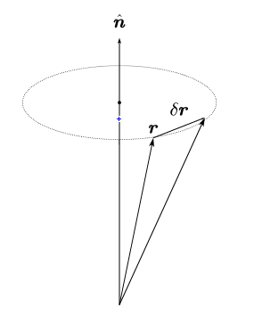

# 经典力学第 9 次作业

## J20.01

For generating functions, they generate canonical transformations, as a result the $Q$ and $P$ satisfied Poisson bracket
$$
\left[ Q,P \right] _{qp}=\sum_k{\left( \frac{\partial Q}{\partial q_k}\frac{\partial P}{\partial p_k}-\frac{\partial Q}{\partial p_k}\frac{\partial P}{\partial q_k} \right) =s_{ij}}.
$$
The $s_{ij}$ has unit of pure $1$ so the unit of $QP$ and $qp$ is same. And according to
$$
\begin{align}
\mathrm{d}U_1&=p\mathrm{d}q-P\mathrm{d}Q,
\\
\mathrm{d}U_2&=p\mathrm{d}q+Q\mathrm{d}P,
\\
\mathrm{d}U_3&=-q\mathrm{d}p-P\mathrm{d}Q,
\\
\mathrm{d}U_4&=-q\mathrm{d}p+Q\mathrm{d}P,
\end{align}
$$
So $U_i$ has the same unit of action.

## J20.06

### (1) {#J20.06_1}

The Hessian matrix must be inversible so
$$
\left| \frac{\partial ^2U_2}{\partial q_k\partial P_l} \right|=\left| \frac{\partial f_k\left( P \right)}{\partial P_l} \right|\ne 0.
$$

### (2) {#J20.06_2}

For generating relationship
$$
p_k=\frac{\partial U_2}{\partial q_k}=f_k\left( P \right),
$$
with the condition in (1) we know that $f_k(P)$ is invertible, as a result
$$
P_l=f^{-1}\left( p_k \right).
$$

### (2) {#J20.06_3}

This transformation is not Lagrangian type. This type requires that relation of
$$
Q=Q\left( q,t \right),
$$
but
$$
Q_l=\frac{\partial U_2}{\partial P_l}=\sum_{k=1}^D{q_k\frac{\partial f_k\left( P \right)}{\partial P_l}=Q_l\left( q,P \right) =Q_l\left( q,f^{-1}\left( p \right) \right) =Q_l\left( q,p \right)}.
$$
$Q$ is depende on $p$.

## J20.12&J20.13 {#J20.12J20.13}

### (1) {#J20.12J20.13_1}

According to differential tranformation formula we have
$$
\delta \boldsymbol{r}=\epsilon \frac{\partial G}{\partial \boldsymbol{p}}=\epsilon \hat{\boldsymbol{n}},
$$
$$
\delta \boldsymbol{p}=-\epsilon \frac{\partial G}{\partial \boldsymbol{r}}=0.
$$

### (2) {#J20.12J20.13_2}

Use the same formula we have
$$
\delta \boldsymbol{r}=\epsilon \frac{\partial G}{\partial \boldsymbol{p}}=0,
$$
$$
\delta \boldsymbol{p}=-\epsilon \frac{\partial G}{\partial \boldsymbol{r}}=\epsilon \hat{\boldsymbol{n}}.
$$

### (3) {#J20.12J20.13_3}

Use the same formula, but use Levi-Civita note to help calcilate vectors,
$$
G=\hat{\boldsymbol{n}}\cdot \left( \boldsymbol{r}\times \boldsymbol{p} \right) =\epsilon _{abc}r_ap_bn_c,
$$
$$
\delta \boldsymbol{r}=\epsilon \frac{\partial G}{\partial \boldsymbol{p}}=\epsilon \frac{\partial G}{\partial p_b}\boldsymbol{e}_b=\epsilon \epsilon _{abc}r_an_c\boldsymbol{e}_b=\epsilon \hat{\boldsymbol{n}}\times \boldsymbol{r},
$$
$$
\delta \boldsymbol{p}=-\epsilon \frac{\partial G}{\partial \boldsymbol{r}}=-\epsilon \frac{\partial G}{\partial r_a}\boldsymbol{e}_a=-\epsilon \epsilon _{abc}p_bn_c\boldsymbol{e}_a=\epsilon \hat{\boldsymbol{n}}\times \boldsymbol{p}.
$$

### (4) {J20.12J20.13_4}

Opinion: Consider the length and angular of vectors.
$$
\left| \boldsymbol{r}^{\prime} \right|=\sqrt{\boldsymbol{r}^{\prime2}}=\sqrt{\boldsymbol{r}^2+\epsilon ^2\left( \hat{\boldsymbol{n}}\times \boldsymbol{r} \right) ^2}=\left| \boldsymbol{r} \right|\qquad \epsilon \rightarrow 0.
$$
$\boldsymbol{p}$ as the same.

Another opinion:

## L09.09

根据 $\mathrm{d}U=\mathrm{d}U_2=p\mathrm{d}q+Q\mathrm{d}P$ 得到
$$
\begin{cases}
p_1=\dfrac{\partial U}{\partial q_1}=P_1\cos \omega t-P_2\sin \omega t,\\
p_2=\dfrac{\partial U}{\partial q_2}=P_1\sin \omega t+P_2\cos \omega t,\\
p_3=\dfrac{\partial U}{\partial q_3}=P_3.\\
\end{cases}
$$
$$
\begin{cases}
Q_1=\dfrac{\partial U}{\partial P_1}=q_1\cos \omega t+q_2\sin \omega t,\\
Q_2=\dfrac{\partial U}{\partial P_2}=-q_1\sin \omega t+q_2\cos \omega t,\\
Q_3=\dfrac{\partial U}{\partial P_3}=q_3.\\
\end{cases}
$$

注意到此变换是正交变换, 于是立刻可以写出
$$
K=H+\frac{\partial U}{\partial t}=\frac{1}{2m}\left( P_{1}^{2}+P_{2}^{2}+P_{3}^{2} \right) +\omega \left( Q_2P_1-Q_1P_2 \right) +V\left( R \right),
$$
其中 $R^2=Q_{1}^{2}+Q_{2}^{2}+Q_{3}^{2}=r^2$.

## L09.10

### (1) {#L09.10_1}

根据 Hamilton 正则方程, 得到
$$
\begin{cases}
\dot{q}=\dfrac{\partial H}{\partial p}=Yq+Zp,\\
\dot{p}=-\dfrac{\partial H}{\partial q}=-Xq-Yp.\\
\end{cases}
$$
整理成不含 $p$ 的方程
$$
\ddot{q}=-\left( XZ-Y^2 \right) q,
$$
是简写运动方程, 所以体系做简谐运动, 周期为
$$
\omega =\sqrt{XZ-Y^2}.
$$

### (2) {#L09.10_2}

因为这是个简谐运动, 于是做用量变量可以写作相图中封闭路径的面积, 得到
$$
J=\oint{p\mathrm{d}q}=\pi p_0q_0,
$$
下面考究能量
$$
E=\frac{p_{0}^{2}}{2m}=\frac{m\omega ^2q_{0}^{2}}{2},
$$
于是
$$
E^2=\frac{\omega ^2p_{0}^{2}q_{0}^{2}}{4}\Rightarrow p_0q_0=\frac{2E}{\omega},
$$
最终
$$
J=\frac{2\pi E}{\omega}.
$$

### (3) {#L09.10_3}

不妨变换不显含时间 ($K$ 不显含时间), 得到
$$
K=H,
$$
$$
P^2+\left( XZ-Y^2 \right) Q^2=Xq^2+2Yqp+Zp^2.
$$
代入 $q=\sqrt{Z}Q$ 得到
$$
P=\frac{Y}{\sqrt{Z}}q+\sqrt{Z}p,
$$
$P$ 被表达为 $q, p$ 的函数, 然后
$$
P=YQ+\sqrt{Z}p,
$$
所以不妨选用第三类生成函数, 得到方程
$$
q=-\frac{\partial U_3}{\partial p},\qquad P=-\frac{\partial U_3}{\partial Q},
$$
解方程得到 $U_3=-\sqrt{Z}Qp-\frac{1}{2}YQ^2$.
